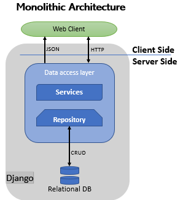

# PheWas Django App


This app is a simple rest api that provides information from the phewas database

## Architecture

This is a Monolithic project Using the Django Framework to handel the full Application from the persistence layer to the http request and response.



## Installation/SetUp

### On Mac OS

Overview of steps:
1) Install HomeBrew
2) Install python3
3) Install VirtualEnvironment
4) cd to project directory and create virtualenv
5) activate virtualenv
6) Install django
   RunServeer and open the Browser
Hoorah!!!


### 1) Install HomeBrew
Homebrew is a software package management system that simplifies the installation of software on Apple’s macOS operating system.

```linux
 /usr/bin/ruby -e "$(curl -fsSL https://raw.githubusercontent.com/Homebrew/install/master/install)"
```

### 2) Install python3

```linux
brew install python3
```
```linux
python3 --version
```

### 3) Install Virtual Environment:

After installing the virtual environment, install all other packages including django in the virtualenv itself.

```python
sudo pip3 install virtualenv
```

### 7) Change directory project directory and create virtualenv

Go to your project directory 
```linux
cd project1
```
Create virtual environment "venv"
```python
virtualenv venv -p python3
```

### 9) activate virtualenv

```python
source venv/bin/activate
```
to exit the venv use
```python
deactivate
```

### 11) Install django
```python
pip install Django
```

### Run your Project
```python
python manage.py runserver 8080
```
Quit the server with CONTROL-C.
